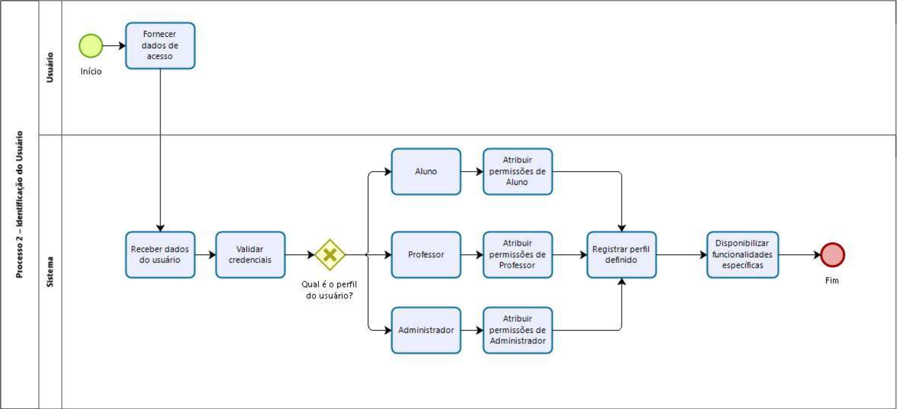

### 3.3.2 Processo 2 – Identificação do Usuário e Definição do Perfil

O processo 2 consiste na identificação automática do usuário após o login/cadastro e na atribuição do perfil correto (aluno, professor, monitor ou administrador). Esse fluxo é essencial para garantir que os acessos sejam personalizados de acordo com as responsabilidades e permissões de cada tipo de usuário dentro da plataforma.

**Oportunidades de melhoria:**
* Automatizar a definição de perfis por meio da matrícula e cargo cadastrados, evitando erros manuais;
* Garantir que permissões sejam atribuídas dinamicamente, facilitando o gerenciamento de acessos;
* Possibilitar ajustes administrativos em casos especiais, como mudança de função do usuário (ex.: aluno que se torna monitor).

### 3.3.2 Processo 2 – Identificação do Usuário e Definição do Perfil  

O processo 2 tem como objetivo identificar o perfil do usuário após o fornecimento dos dados de acesso, validar suas credenciais e, em seguida, atribuir as permissões correspondentes (Aluno, Professor ou Administrador). Dessa forma, a plataforma garante que cada usuário tenha acesso às funcionalidades adequadas ao seu papel institucional.  

**Oportunidades de melhoria:**  
- Garantir que a validação de credenciais seja automatizada e integrada com os sistemas institucionais;  
- Minimizar erros de atribuição de perfil através da verificação automática dos dados;  
- Otimizar a experiência do usuário, permitindo que apenas funcionalidades relevantes sejam exibidas.  

  

---

#### Detalhamento das atividades  

**Atividade 1 – Fornecer dados de acesso (Usuário)**  

| **Campo**        | **Tipo**        | **Restrições**                                  | **Valor default** |
|-------------------|-----------------|-------------------------------------------------|-------------------|
| login             | Caixa de texto  | formato de e-mail institucional (xxxx@sga.pucminas.br) |                   |
| senha             | Caixa de texto  | mínimo 8 caracteres, incluindo letra maiúscula, número e caractere especial |                   |

| **Comandos**       | **Destino**           | **Tipo**   |
|--------------------|-----------------------|------------|
| enviar             | Receber dados do usuário | default |
| cancelar           | Encerrar processo     | cancel     |

---

**Atividade 2 – Receber dados do usuário (Sistema)**  

| **Campo**           | **Tipo**  | **Restrições**                       | **Valor default** |
|----------------------|-----------|--------------------------------------|-------------------|
| dados recebidos      | Tabela    | armazenar login e senha informados   |                   |

| **Comandos**        | **Destino**        | **Tipo**   |
|---------------------|--------------------|------------|
| validar credenciais | Validar credenciais | default    |

---

**Atividade 3 – Validar credenciais (Sistema)**  

| **Campo**           | **Tipo**  | **Restrições**                                      | **Valor default** |
|----------------------|-----------|-----------------------------------------------------|-------------------|
| credenciais válidas  | Booleano  | autenticação obrigatória no banco de dados institucional |                   |

| **Comandos**         | **Destino**                    | **Tipo**   |
|----------------------|--------------------------------|------------|
| credenciais válidas  | Decisão: Qual é o perfil?      | default    |
| credenciais inválidas| Fornecer dados de acesso       | cancel     |

---

**Atividade 4 – Identificar perfil do usuário (Sistema)**  

| **Campo**         | **Tipo**       | **Restrições**                                          | **Valor default** |
|--------------------|----------------|---------------------------------------------------------|-------------------|
| perfil usuário     | Seleção única  | Aluno / Professor / Administrador, definido automaticamente |                   |

| **Comandos**       | **Destino**                       | **Tipo**   |
|--------------------|-----------------------------------|------------|
| aluno              | Atribuir permissões de Aluno      | default    |
| professor          | Atribuir permissões de Professor  | default    |
| administrador      | Atribuir permissões de Administrador | default |

---

**Atividade 5 – Atribuir permissões**  

| **Campo**                 | **Tipo**         | **Restrições**                                                                 | **Valor default** |
|----------------------------|------------------|--------------------------------------------------------------------------------|-------------------|
| permissões atribuídas      | Seleção múltipla | aluno = postar/perguntar; professor = responder/validar; administrador = gerenciar sistema |                   |

| **Comandos**        | **Destino**                | **Tipo**   |
|---------------------|-----------------------------|------------|
| registrar perfil    | Registrar perfil definido   | default    |

---

**Atividade 6 – Registrar perfil definido**  

| **Campo**          | **Tipo**       | **Restrições**               | **Valor default** |
|---------------------|----------------|------------------------------|-------------------|
| perfil confirmado   | Caixa de texto | armazenar perfil atribuído   |                   |

| **Comandos**        | **Destino**                            | **Tipo**   |
|---------------------|----------------------------------------|------------|
| salvar              | Disponibilizar funcionalidades específicas | default |

---

**Atividade 7 – Disponibilizar funcionalidades específicas**  

| **Campo**          | **Tipo**       | **Restrições**                                       | **Valor default** |
|---------------------|----------------|------------------------------------------------------|-------------------|
| funcionalidades     | Seleção múltipla | liberadas conforme perfil (aluno/professor/admin)    |                   |

| **Comandos**        | **Destino**        | **Tipo**   |
|---------------------|--------------------|------------|
| concluir processo   | Fim do processo    | default    |

---

_Tipos de dados utilizados:_  

* **Área de texto** - campo texto de múltiplas linhas  
* **Caixa de texto** - campo texto de uma linha  
* **Número** - campo numérico  
* **Data** - campo do tipo data (dd-mm-aaaa)  
* **Hora** - campo do tipo hora (hh:mm:ss)  
* **Data e Hora** - campo do tipo data e hora (dd-mm-aaaa, hh:mm:ss)  
* **Imagem** - campo contendo uma imagem  
* **Seleção única** - campo com várias opções de valores que são mutuamente exclusivas (radio button ou combobox)  
* **Seleção múltipla** - campo com várias opções que podem ser selecionadas mutuamente (checkbox ou listbox)  
* **Arquivo** - campo de upload de documento  
* **Link** - campo que armazena uma URL  
* **Tabela** - campo formado por uma matriz de valores  